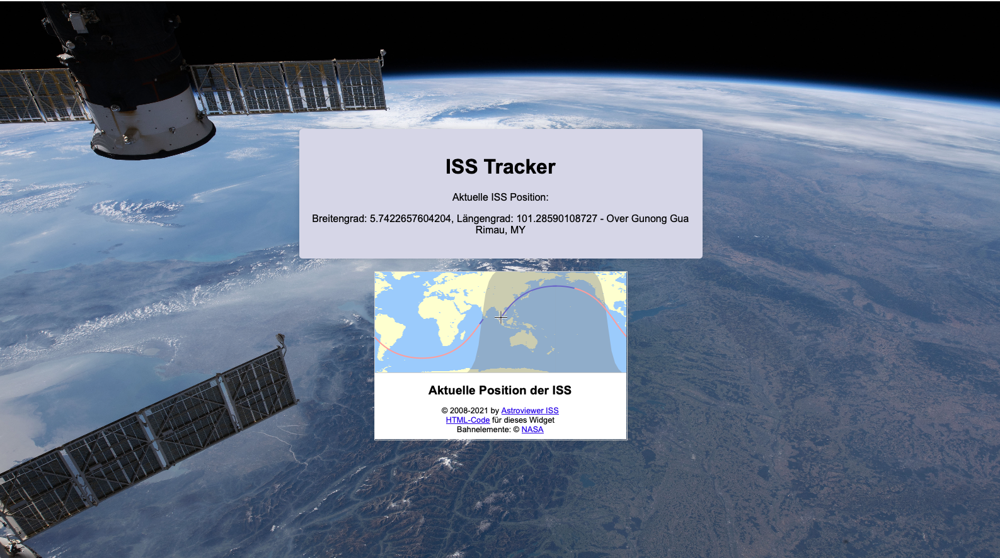

# Welcome to Bechtle
> Your Tasks To Your Site 
## Website
1. Erstelle ein HTML Grundgerüst  
   [How To - HTML](https://www.w3schools.com/html/html_intro.asp)   
2. Erstelle einen grauen Kasten mit Textinhalt  
   [How To - DIV](https://www.w3schools.com/html/html_div.asp)   
3. Ergänze nun eine Box, welche eine Karte enthalten wird  
   [How To - iFrame](https://www.w3schools.com/html/html_iframe.asp)   
4. Ach ja, Bilder machen eine Seite schöner  
   [How To - Image](https://www.w3schools.com/html/html_images.asp)  

## Styling
1. Erstelle nun eine CSS Datei für die Styles  
   [How To - CSS](https://www.w3schools.com/css/css_howto.asp)   
2. Verschönere deine Texte nun so, dass sie zum Template passt  
   [How To - Text](https://www.w3schools.com/css/css_text.asp)   
3. Zum Schluss noch ein paar Tipps zur Ausrichtung  
   [How To - Grid I](https://www.w3schools.com/css/css_grid.asp)  
   [How To - Grid II](https://css-tricks.com/snippets/css/complete-guide-grid/) 
   [How To - Flexbox](https://css-tricks.com/snippets/css/a-guide-to-flexbox/) 

## Technik
1. Erstelle eine JavaScript Datei  
   [How To - Script](https://www.w3schools.com/js/js_whereto.asp)  
2. Verbinde dich nun mit der API um die ISS tracken zu können  
   [How To - API I](https://www.w3schools.com/js/js_api_intro.asp) 
   [How To - API II](https://www.freecodecamp.org/news/make-api-calls-in-javascript/) 

## Template
> Look how it shoot look like
 
